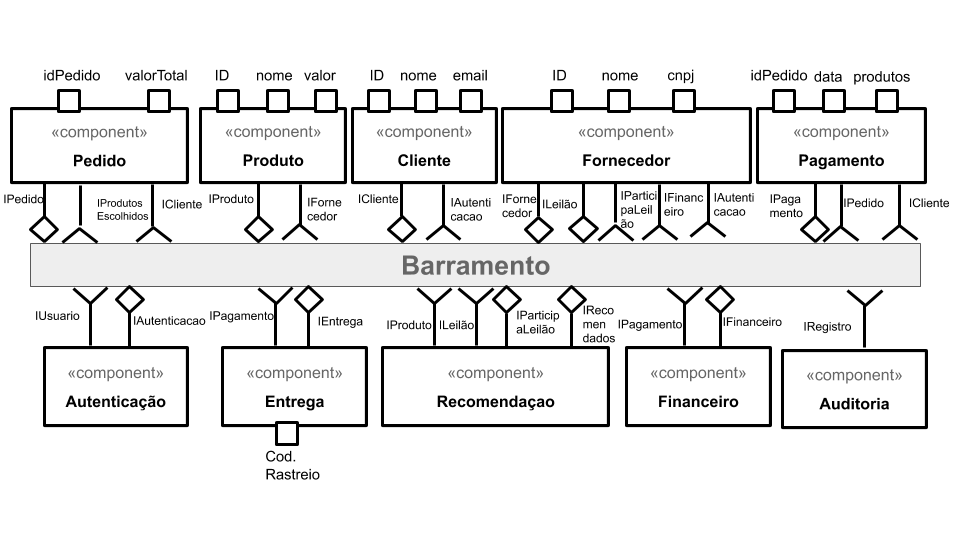
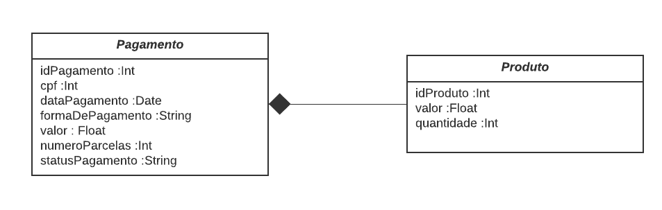

# Estrutura de Arquivos e Pastas

A seguir é apresentada a estrutura de pastas do projeto:

~~~
├── README.md 
│
├── images
│
└── resources
~~~

# Projeto `MarketPlace`

# Equipe 08
* `Aline Souza Silva RG: 36.783.233-1
* `Erik Borges RG: 15.434.065
* `Lucas Trinquinato RG: 50.260.503-0
* `Paulo Sérgio Marchioreto RG: 27.303.073-5
* `Renato César Alves de Oliveira RG: 36.536.287-6

# Nível 1

Neste primeiro nível, primeiramente listamos todas as funcionalidades que contemplam o Gerenciamento de Fornecedores em MarketPlace.
Após esse primeiro levantamento, componentizamos essas funcionalidades de modo que representem módulos do sistema, conforme pode ser visto abaixo:

## Diagrama Geral do Nível 1

> 

### Detalhamento da interação de componentes

Para melhor compreensão das responsabilidades de cada um dos componentes observados acima, realizamos o detalhamento de suas devidas interações, seguindo o fluxo de acontecimento:

* Componente `Autenticação`:
  - Assina:
    > N/A
  - Publica:
    > * Responsável por dizer, através da interface recebida `Usuário`, se ele está autorizado ou não a realizar ações no sistema (como finalizar uma compra, cadastrar um produto, visualizar seus pedidos, etc). Essa interface `Usuário` é extendida por duas outras interfaces denominadas `Fornecedor` e `Cliente`. O componente de `Autenticação`, assim que verifica as validações necessárias, publica no barramento a mensagem de tópico `/autenticacao/cliente` ou `/autenticacao/fornecedor`, a depender do tipo de usuário enviado;
    > * Publica no barramento a mensagem de tópico `/auditoria/autenticacao` para que o componente de `Auditoria` seja notificado sempre que ocorrer uma ação.

* Componente `Cliente`:
  - Assina:
  > Assina no barramento mensagens de tópico "`/autenticacao/cliente`" através da interface `Autenticação`. Quando recebe a mensagem, se a autenticação tiver sido bem sucedida, o cliente estará logado e poderá prosseguir autenticado. Caso a autenticação tenha falhado, o usuário será redirecionado para uma nova tentativa;
  - Publica: 
  > Publica no barramento a mensagem de tópico `/auditoria/cliente` para que o componente de `Auditoria` seja notificado sempre que ocorrer uma ação.

* Componente `Fornecedor`: 
  - Assina:
  > Assina no barramento mensagens de tópico "`/autenticacao/fornecedor`" através da interface `Autenticação`. Quando recebe a mensagem, se a autenticação tiver sido bem sucedida, o fornecedor estará logado e poderá prosseguir autenticado. Caso a autenticação tenha falhado, o fornecedor será redirecionado para uma nova tentativa. 
  > Assina no barramento mensagens de tópico "`/financeiro/transacoes`" através da interface `Financeiro`. Quando recebe a mensagem, o fornecedor terá acesso aos detalhes financeiros de suas transações dos pedidos solicitados, como: acompanhamento das vendas, acompanhamento das entregas já efetuadas, notas fiscais emitidas, valores a serem repassados, entre outros.
  - Publica: 
  > Publica no barramento a mensagem de tópico `/auditoria/fornecedor` para que o componente de `Auditoria` seja notificado sempre que ocorrer uma ação.

* Componente `Produto`:
  - Assina:
    > N/A
  - Publica: 
    > Publica no barramento mensagens de tópico "`produto/novo`" através da interface `IProduto` sempre que um novo produto é adicionado.
    > Publica no barramento a mensagem de tópico `/auditoria/produto` para que o componente de `Auditoria` seja notificado sempre que ocorrer uma ação.

* Componente `Pedido`:
  - Assina:
    > N/A
  - Publica: 
    > Publica no barramento a mensagem de tópico `/auditoria/pedido` para que o componente de `Auditoria` seja notificado sempre que ocorrer uma ação.

* Componente `Pagamento`:
  - Assina:
    > N/A
  - Publica: 
    > Publica no barramento a mensagem de tópico `/auditoria/pagamento` para que o componente de `Auditoria` seja notificado sempre que ocorrer uma ação.

* Componente `Entrega`:
  - Assina:
    > N/A
  - Publica: 
    > Publica no barramento a mensagem de tópico `/auditoria/pagamento` para que o componente de `Auditoria` seja notificado sempre que ocorrer uma ação.

* Componente `Recomendação`:
  - Assina:
    > N/A
  - Publica: 
    > Publica no barramento a mensagem de tópico `/auditoria/pagamento` para que o componente de `Auditoria` seja notificado sempre que ocorrer uma ação.

* Componente `Financeiro`:
  - Assina:
    > N/A
  - Publica: 
    > Publica no barramento a mensagem de tópico `/auditoria/pagamento` para que o componente de `Auditoria` seja notificado sempre que ocorrer uma ação.

* Componente `Auditoria`:
  - Assina:
    > Responsável por assinar o barramento de mensagem de todas as ações que os componentes enviam ("`/auditoria/cliente`", "`/auditoria/fornecedor`", "`/auditoria/produto`", "`/auditoria/pedido`", "`/auditoria/pagamento`", "`/auditoria/entrega`", "`/auditoria/recomendacao`", "`/auditoria/autenticacao`" e "`/auditoria/financeiro`") através da `Interface Registro`. Quando recebe uma mensage, o componente realiza a integração com banco de dados para armazenar o log da ação (dados como: quem fez ação, o que fez, em que data fez) para uma possível auditoria do Sistema;
  - Publica: 
    > N/A

Descrição dos componentes:

## Componente `Autenticação`

> Componente responsável pelo processo de autenticação e persistência do Login no MarketPlace. Disponibiliza serviços como: Login, Logout, Recuperar a senha.

**Interfaces**
> * Interface Autenticação
> * Interface Usuário

As interfaces listadas são detalhadas a seguir:

## Detalhamento das Interfaces

### Interface `Autenticação`

> Essa interface é responsável por enviar o status da autenticação;

**Tópico**: `<tópico que a respectiva interface assina ou publica>`

Classes que representam objetos JSON associados às mensagens da interface:

~~~json
<Formato da mensagem JSON associada ao objeto enviado/recebido por essa interface.>
~~~

Detalhamento da mensagem JSON:

Atributo | Descrição
-------| --------
`<nome do atributo>` | `<objetivo do atributo>`

## Interface `Usuário`

> Resumo do papel da interface.

**Tópico**: `<tópico que a respectiva interface assina ou publica>`

Classes que representam objetos JSON associados às mensagens da interface:

~~~json
<Formato da mensagem JSON associada ao objeto enviado/recebido por essa interface.>
~~~

Detalhamento da mensagem JSON:

Atributo | Descrição
-------| --------
`<nome do atributo>` | `<objetivo do atributo>`

## Componente `Cliente`

> Este componente é responsável por todo o gerenciamento do Cliente. Serviços como: Manter o cadastro do cliente........

**Interfaces**
> * Interface Autenticação
> * Interface Cliente

As interfaces listadas são detalhadas a seguir:

## Detalhamento das Interfaces

### Interface `Autenticação`

> Resumo do papel da interface.

**Tópico**: `<tópico que a respectiva interface assina ou publica>`

Classes que representam objetos JSON associados às mensagens da interface:

~~~json
<Formato da mensagem JSON associada ao objeto enviado/recebido por essa interface.>
~~~

Detalhamento da mensagem JSON:

Atributo | Descrição
-------| --------
`<nome do atributo>` | `<objetivo do atributo>`

## Interface `Cliente`

> Resumo do papel da interface.

**Tópico**: `<tópico que a respectiva interface assina ou publica>`

Classes que representam objetos JSON associados às mensagens da interface:

~~~json
<Formato da mensagem JSON associada ao objeto enviado/recebido por essa interface.>
~~~

Detalhamento da mensagem JSON:

Atributo | Descrição
-------| --------
`<nome do atributo>` | `<objetivo do atributo>`

## Componente `Fornecedor`

> Este componente é responsável por gerenciar o fornecedor. Desde o cadastro, até manter seus dados atualizados.

**Interfaces**
> * Interface Fornecedor
> * Interface Financeiro
> * Interface Autenticação

As interfaces listadas são detalhadas a seguir:

## Detalhamento das Interfaces

### Interface `Fornecedor`

> Resumo do papel da interface.

**Tópico**: `<tópico que a respectiva interface assina ou publica>`

Classes que representam objetos JSON associados às mensagens da interface:

~~~json
<Formato da mensagem JSON associada ao objeto enviado/recebido por essa interface.>
~~~

Detalhamento da mensagem JSON:

Atributo | Descrição
-------| --------
`<nome do atributo>` | `<objetivo do atributo>`

### Interface `Financeiro`

> Interface para envio de relatório financeiro ao fornecedor.

**Tópico**:  
Assina: 
`pedido/{id}/dados` 
Publica: 
`financeiro/relatorios/{id}`

Classes que representam objetos JSON associados às mensagens da interface:

~~~json
{
  "idRelatorio": 23421,
  "cnpj": 23242121233,
  "periodo": {
    "inicio": "2009-10-04",
    "fim": "2009-11-04",
  },
  "totalVendas": 14200.00,
  "quantidadeProdutos": 17,
  "produtos": {
    "produto": {
       "idProduto": "1245",
	   "valor": 2000.00,
       "quantitidade": 4
    },
    "produto": {
       "idProduto": "3323",
	   "valor": 100.00,
       "quantitidade": 2
    },
	"produto": {
       "idProduto": "5555",
	   "valor": 500.00
       "quantitidade": 4
    },
	"produto": {
       "idProduto": "9931",
	   "valor": 200.00,
       "quantitidade": 5
    },
	"produto": {
       "idProduto": "6633",
	   "valor": 1500.00,
       "quantitidade": 2
    },
  }  
}
~~~

Detalhamento da mensagem JSON:

**Relatório Financeiro**
Atributo | Descrição
-------| --------
idRelatorio | identificador do relatório
cnpj | cnpj do fornecedor que solicitou o relatorio
periodo | período a ser considerado para o a construção do relatório
totalVendas | valor total do montante de vendas no período
quantidadeProdutos | quantidade produtos vendidos no período

**Produto**
Atributo | Descrição
-------| --------
idProduto | identificador do produto
valor | valor do produto
quantidade | quantidade de determinado produto vendida no período

### Interface `Autenticação`

> Resumo do papel da interface.

**Tópico**: `<tópico que a respectiva interface assina ou publica>`

Classes que representam objetos JSON associados às mensagens da interface:

~~~json
<Formato da mensagem JSON associada ao objeto enviado/recebido por essa interface.>
~~~

Detalhamento da mensagem JSON:

Atributo | Descrição
-------| --------
`<nome do atributo>` | `<objetivo do atributo>`

## Componente `Produto`

> Este componente é responsável por manter os dados do produto, desde o cadastro do mesmo, como categorização......

**Interfaces**
> * Interface Produto

A interface listada será detalhada a seguir:

## Detalhamento da Interface

### Interface `Produto`

> Resumo do papel da interface.

**Tópico**: `<tópico que a respectiva interface assina ou publica>`

Classes que representam objetos JSON associados às mensagens da interface:

~~~json
<Formato da mensagem JSON associada ao objeto enviado/recebido por essa interface.>
~~~

Detalhamento da mensagem JSON:

Atributo | Descrição
-------| --------
`<nome do atributo>` | `<objetivo do atributo>`

## Componente `Pedido`

> Este componente é responsável por todo o fluxo do pedido. Desde quando o cliente encontra o produto desejado, visualiza sua descrição e o coloca no carrinho.

**Interfaces**
> * Interface Pedido
> * Interface Produto
> * Interface Fornecedor

As interfaces listadas são detalhadas a seguir:

## Detalhamento das Interfaces

### Interface `Pedido`

> Resumo do papel da interface.

**Tópico**: `<tópico que a respectiva interface assina ou publica>`

Classes que representam objetos JSON associados às mensagens da interface:

~~~json
<Formato da mensagem JSON associada ao objeto enviado/recebido por essa interface.>
~~~

Detalhamento da mensagem JSON:

Atributo | Descrição
-------| --------
`<nome do atributo>` | `<objetivo do atributo>`

### Interface `Produto`

> Resumo do papel da interface.

**Tópico**: `<tópico que a respectiva interface assina ou publica>`

Classes que representam objetos JSON associados às mensagens da interface:

~~~json
<Formato da mensagem JSON associada ao objeto enviado/recebido por essa interface.>
~~~

Detalhamento da mensagem JSON:

Atributo | Descrição
-------| --------
`<nome do atributo>` | `<objetivo do atributo>`

### Interface `Fornecedor`

> Resumo do papel da interface.

**Tópico**: `<tópico que a respectiva interface assina ou publica>`

Classes que representam objetos JSON associados às mensagens da interface:

~~~json
<Formato da mensagem JSON associada ao objeto enviado/recebido por essa interface.>
~~~

Detalhamento da mensagem JSON:

Atributo | Descrição
-------| --------
`<nome do atributo>` | `<objetivo do atributo>`

## Componente `Pagamento`

> Este componente é responsável pelo pagamento efetivo do pedido realizado. Dentre os serviços estão: Cálculo de frete, consulta do cadastro do usuário, consulta da instituição financeira responsável pelo pagamento e confirmação do pedido para o componente  de entrega.

**Interfaces**
> * Interface Pagamento
> * Interface Pedido
> * Interface Cliente

As interfaces listadas são detalhadas a seguir:

## Detalhamento das Interfaces

### Interface `Pagamento`

> Interface para envio dos detalhes do pafamento.

**Tópico**:  
Assina: 
`produto/{id}/dados`
`cliente/{id}/dados` 
Publica: 
`pagamento/{id}/dados`

Classes que representam objetos JSON associados às mensagens da interface:

~~~json
{
  "idPagamento": 44323,
  "cpf": 33242121233,
  "dataPagamento": "2009-10-04",
  "valor": 87.66,
  "formaDePagamento": "Cartao de Credito",
  "numeroParcelas": 9,
  "statusPagamento": "Pendente",
  "produtos": {
    "produto": {
       "idProduto": "1245",
	   "valor": 55.33,
       "quantitidade": 1
    },
    "produto": {
       "idProduto": "3323",
	   "valor": 32.33,
       "quantitidade": 1
    },
  }  
}
~~~

Detalhamento da mensagem JSON:

**Pagamento**
Atributo | Descrição
-------| --------
idPagamento | identificador do pagamento
cpf | cpf do cliente
dataPagamento | data da efetivação do pagamento
valor | valor total do pedido
formaDePagamento | forma de pagamento (cartao crédito, débito, boleto, etc)
numeroParcelas | quantidade de parcelas, caso parcelado, valor default 1
statusPagamento | status do pagamento (pendente, recusado, finalizado)

**Produto**
Atributo | Descrição
-------| --------
idProduto | identificador do produto
valor | valor do produto
quantidade | quantidade de determinado produto vendida no período

**Produto**
Atributo | Descrição
-------| --------
idProduto | identificador do produto
valor | valor do produto
quantidade | quantidade de determinado produto no pedido do cliente

### Interface `Pedido`

> Resumo do papel da interface.

**Tópico**: `<tópico que a respectiva interface assina ou publica>`

Classes que representam objetos JSON associados às mensagens da interface:

~~~json
<Formato da mensagem JSON associada ao objeto enviado/recebido por essa interface.>
~~~

Detalhamento da mensagem JSON:

Atributo | Descrição
-------| --------
`<nome do atributo>` | `<objetivo do atributo>`

### Interface `Cliente`

> Resumo do papel da interface.

**Tópico**: `<tópico que a respectiva interface assina ou publica>`

Classes que representam objetos JSON associados às mensagens da interface:

~~~json
<Formato da mensagem JSON associada ao objeto enviado/recebido por essa interface.>
~~~

Detalhamento da mensagem JSON:

Atributo | Descrição
-------| --------
`<nome do atributo>` | `<objetivo do atributo>`

## Componente `Recomendação`

> <Resumo do papel do componente e serviços que ele oferece.>

**Interfaces**
> * Listagem das interfaces do componente.

As interfaces listadas são detalhadas a seguir:

## Detalhamento das Interfaces

### Interface `Cliente`

> Resumo do papel da interface.

**Tópico**: `<tópico que a respectiva interface assina ou publica>`

Classes que representam objetos JSON associados às mensagens da interface:

~~~json
<Formato da mensagem JSON associada ao objeto enviado/recebido por essa interface.>
~~~

Detalhamento da mensagem JSON:

Atributo | Descrição
-------| --------
`<nome do atributo>` | `<objetivo do atributo>`

## Componente `Entrega`

> <Resumo do papel do componente e serviços que ele oferece.>

**Interfaces**
> * Listagem das interfaces do componente.

As interfaces listadas são detalhadas a seguir:

## Detalhamento das Interfaces

### Interface `Cliente`

> Resumo do papel da interface.

**Tópico**: `<tópico que a respectiva interface assina ou publica>`

Classes que representam objetos JSON associados às mensagens da interface:

~~~json
<Formato da mensagem JSON associada ao objeto enviado/recebido por essa interface.>
~~~

Detalhamento da mensagem JSON:

Atributo | Descrição
-------| --------
`<nome do atributo>` | `<objetivo do atributo>`

## Componente `Financeiro`

> <Resumo do papel do componente e serviços que ele oferece.>

**Interfaces**
> * Listagem das interfaces do componente.

As interfaces listadas são detalhadas a seguir:

## Detalhamento das Interfaces

### Interface `Cliente`

> Resumo do papel da interface.

**Tópico**: `<tópico que a respectiva interface assina ou publica>`

Classes que representam objetos JSON associados às mensagens da interface:

~~~json
<Formato da mensagem JSON associada ao objeto enviado/recebido por essa interface.>
~~~

Detalhamento da mensagem JSON:

Atributo | Descrição
-------| --------
`<nome do atributo>` | `<objetivo do atributo>`

## Componente `Auditoria`

> <Resumo do papel do componente e serviços que ele oferece.>

**Interfaces**
> * Listagem das interfaces do componente.

As interfaces listadas são detalhadas a seguir:

## Detalhamento das Interfaces

### Interface `Cliente`

> Resumo do papel da interface.

**Tópico**: `<tópico que a respectiva interface assina ou publica>`

Classes que representam objetos JSON associados às mensagens da interface:

~~~json
<Formato da mensagem JSON associada ao objeto enviado/recebido por essa interface.>
~~~

Detalhamento da mensagem JSON:

Atributo | Descrição
-------| --------
`<nome do atributo>` | `<objetivo do atributo>`

# Nível 2

Apresente aqui o detalhamento do Nível 2 conforme detalhado na especificação com, no mínimo, as seguintes subseções:

## Diagrama do Nível 2

Apresente um diagrama conforme o modelo a seguir:

> 

### Detalhamento da interação de componentes

O detalhamento deve seguir um formato de acordo com o exemplo a seguir:

* O componente `Entrega Pedido Compra` assina no barramento mensagens de tópico "`pedido/+/entrega`" através da interface `Solicita Entrega`.
  * Ao receber uma mensagem de tópico "`pedido/+/entrega`", dispara o início da entrega de um conjunto de produtos.
* Os componentes `Solicita Estoque` e `Solicita Compra` se comunicam com componentes externos pelo barramento:
  * Para consultar o estoque, o componente `Solicita Estoque` publica no barramento uma mensagem de tópico "`produto/<id>/estoque/consulta`" através da interface `Consulta Estoque` e assina mensagens de tópico "`produto/<id>/estoque/status`" através da interface `Posição Estoque` que retorna a disponibilidade do produto.

Para cada componente será apresentado um documento conforme o modelo a seguir:

## Componente `<Nome do Componente>`

> <Resumo do papel do componente e serviços que ele oferece.>

**Interfaces**
> * Listagem das interfaces do componente.

As interfaces listadas são detalhadas a seguir:

## Detalhamento das Interfaces

### Interface `<nome da interface>`

> 

> <Resumo do papel da interface.>

Método | Objetivo
-------| --------
`<id do método>` | `<objetivo do método e descrição dos parâmetros>`

## Exemplos:

### Interface `ITableProducer`

Interface provida por qualquer fonte de dados que os forneça na forma de uma tabela.

Método | Objetivo
-------| --------
`requestAttributes` | Retorna um vetor com o nome de todos os atributos (colunas) da tabela.
`requestInstances` | Retorna uma matriz em que cada linha representa uma instância e cada coluna o valor do respectivo atributo (a ordem dos atributos é a mesma daquela fornecida por `requestAttributes`.

### Interface `IDataSetProperties`

Define o recurso (usualmente o caminho para um arquivo em disco) que é a fonte de dados.

Método | Objetivo
-------| --------
`getDataSource` | Retorna o caminho da fonte de dados.
`setDataSource` | Define o caminho da fonte de dados, informado através do parâmetro `dataSource`.

# Multiplas Interfaces

> Escreva um texto detalhando como seus componentes  podem ser preparados para que seja possível trocar de interface apenas trocando o componente View e mantendo o Model e Controller.
>
> É recomendado a inserção de, pelo menos, um diagrama que deve ser descrito no texto. O formato do diagrama é livre e deve ilustrar a arquitetura proposta.
